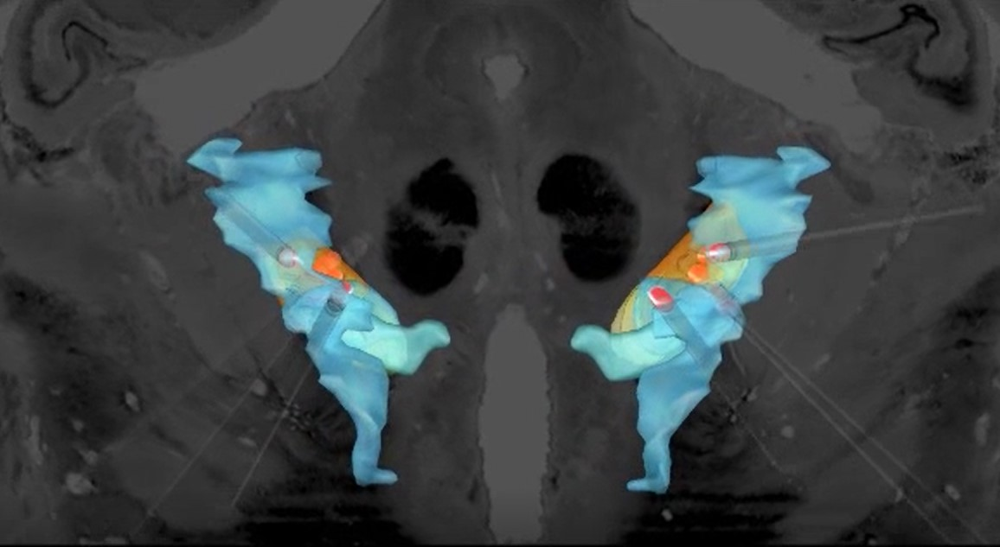

<h1 align="center">Hi 👋, I'm Matteo Vissani</h1>
<h3 align="center">A Postdoctoral Research Fellow in the <a href="https://www.brainmodulationlab.org/" target="blank">Brain Modulation Lab/a> in the Massachusetts general Hospital with a keen interest in neuroscience, neurotechnology and computational modelling.</h3>

 My research interest lies in the intersection between computational methods, neuroengineering and neuroscientific and/or clinical questions. As part of my PhD programme, I am developing theoretical tools and computational approaches to elucidate how different brain regions in basal ganglia communicate and control behaviour in movement disorders, e.g. Parkinson's Disease.

 

 This image was obtained using the advanced processing pipeline  <a href="https://www.sciencedirect.com/science/article/abs/pii/S1053811918307663?via%3Dihub" target="blank"> (Horn & Li et al. 2018)</a> in <a href="https://www.lead-dbs.org/" target="blank"> Lead-DBS</a>.

 Paper: <a href="https://iopscience.iop.org/article/10.1088/1741-2552/ab37b4" target="blank"> Vissani M, Cordella R, Micera S, Eleopra R, Romito LM, Mazzoni A. Spatio-temporal structure of single neuron subthalamic activity identifies DBS target for anesthetized Tourette syndrome patients. J Neural Eng. 2019;16(6):066011. Published 2019 Oct 23.</a>

 

- 🌱 I’m currently learning **Bayesian Framework and Julia**

- 👨‍💻 My website [https://matteovissani.github.io/](https://matteovissani.github.io/)

- 💬 Ask me about **neuroscience, modelling and neurotechnology**

- 📫 How to reach me **matteo.vissani92@gmail.com**

<h2 align="left"> Skills and Tools:

      
 
  
 
 

&nbsp;

